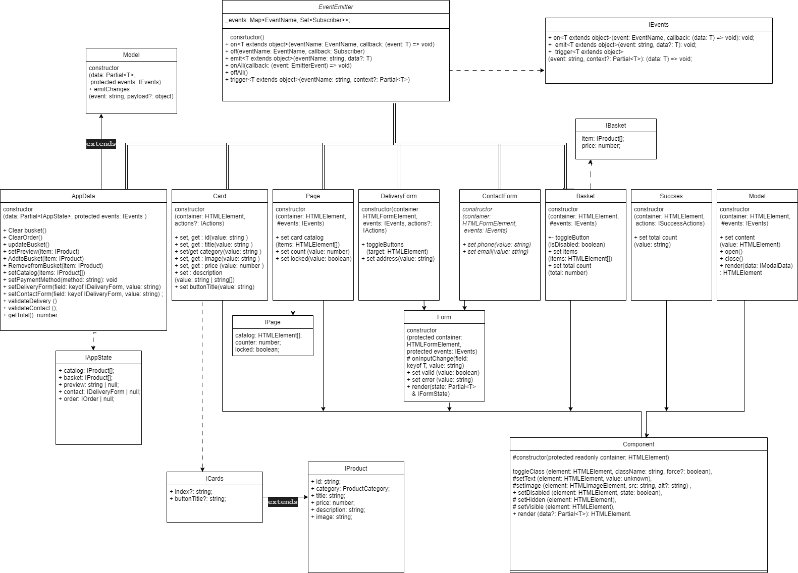

# Проектная работа "Веб-ларек"

Стек: HTML, SCSS, TS, Webpack

Структура проекта:
- src/ — исходные файлы проекта
- src/components/ — папка с JS компонентами
- src/components/base/ — папка с базовым кодом

Важные файлы:
- src/pages/index.html — HTML-файл главной страницы
- src/types/index.ts — файл с типами
- src/index.ts — точка входа приложения
- src/scss/styles.scss — корневой файл стилей
- src/utils/constants.ts — файл с константами
- src/utils/utils.ts — файл с утилитами

## Установка и запуск
Для установки и запуска проекта необходимо выполнить команды

```
npm install
npm run start
```

или

```
yarn
yarn start
```
## Сборка

```
npm run build
```

или

```
yarn build
```

## Базовый код
### Класс Api
Защищенный класс отвечает за работу API. Имеет конструктор, методы get и post, обработчик ответа от сервера.
constructor(baseUrl: string, options: RequestInit = {})
- #handleResponse(response: Response): Promise<object> - обработчик ответа
- get(uri: string) - метод запроса данных
- post(uri: string, data: object, method: ApiPostMethods = 'POST') - метод отправки данных

### Класс Component<T>
Абстрактный класс. Используется для создания элементов интерфейса.
Содержит конструктор и ряд методов для универсальной работы с DOM -компонентами: 
#constructor(protected readonly container: HTMLElement)
- toggleClass (element: HTMLElement, className: string, force?: boolean) - переключается класс,
- #setText (element: HTMLElement, value: unknown) - устанавливает текстовое содержимое,
- #setImage (element: HTMLImageElement, src: string, alt?: string) - устанавливает изображения и альтернативный текст,
- setDisabled (element: HTMLElement, state: boolean) - изменяет статус блокировки,
- setHidden (element: HTMLElement) - скрывает элемент,
- setVisible (element: HTMLElement) - отображает элемент,
- render (data?: Partial<T>): HTMLElement  - возвращает корневой DOM-элемент.

### EventEmitter
Класс - брокер событий. Содержит конструктор, а также методы:
constructor()
- on <T extends object>(eventName: EventName, callback: (event: T) => void) - устанавливает обработчик событий;
- off (eventName: EventName, callback: Subscriber) - снимает обработчик событий;
- emit <T extends object>(eventName: string, data?: T) - инициирует событие с данными;
- onAll (callback: (event: EmitterEvent) => void) - слушает все события;
- offAll - сбрасывает все обработчики;
- trigger <T extends object>(eventName: string, context?: Partial<T>) - триггер, генерирующий событие при вызове;

### Класс Model
Абстрактный класс. Используется для создания модельных данных. Содержит конструктор и метод, сообщающий, об изменениях.
constructor(data: Partial<T>, protected events: IEvents)
- emitChanges(event: string, payload?: object) - уведомляет об изменениях

## Код моделей данных
### Класс AppData 
Класс отвечает за работу с данными, обрабатывает дейсткия пользователя.Наследует класс Model<IProduct> для отслеживания изменений. Содержит конструктор и методы: 

constructor(data, events )
- Clear busket() - отчищает иконку корзины
- ClearOrder() - отчищает заказ
- updateBusket() - обновление иконки корзины
- setPreview(item: IProduct) -открытие карточки продукта
- AddtoBusket(item: IProduct) -добавление в корзину карточки продукта
- RemovefromBusket(item: IProduct) - удаление из корзины карточки продукта
- setCatalog(items: IProduct[]) - меняет список покупок
- setPaymentMethod(method: string): void - меняет метод оплаты,
- setDeliveryForm(field: keyof IDeliveryForm, value: string) - проверяет заполненность форм адреса
- setContactForm(field: keyof IDeliveryForm, value: string) - проверяет заполненность форм контактов;
- validateDelivery - проверяет валидацию форм адреса
- validateContact - проверяет валидацию форм контактов;
- getTotal(): number - итоговый счет выдает

### Класс Form<T>
Класс для работы с формами. Наследуется от Component<IFormState>
Содержит конструктор и методы, отвечающие за работу с валидностью и ошибками при заполнении форм.
constructor(container: HTMLElement,events: IEvents)

- set valid(value: boolean) - обрабатывает валидность
- set error (value: string) - обрабатывает ошибку
- render(state: Partial<T> & IFormState) - рендер страницы

### Класс DeliveryForm 
Класс отвечает за работу c данными адреса заказчика.Наследуется от Form<IDeliveryForm>. Может использоваться для отображения. Содержит конструктор и методы, отвечающие за добавление и изменение данных заказчика

constructor(container: HTMLFormElement, events: IEvents, actions?: IActions)
-	toggleButtons(target: HTMLElement) - добавляет класс для выбранного способа оплаты
- set address(value: string) - добавляет данные адреса

### Класс ContactForm
Класс так-же отвечает за работу c данными контактов заказчика.Наследуется от Form<IDeliveryForm>. Может использоваться для отображения. Содержат конструктор и методы, отвечающие за добавление и изменение данных заказчика

constructor(container: HTMLFormElement, events: IEvents)
- set phone(value: string) - добавляет номер телефона
- set email(value: string) - добавляет электронную почту

## Код отображения
### Класс Page
Класс отвечающий за тображение страницы. Наследуется от Component<IPage> Имеет конструктор и методы
constructor (container: HTMLElement,#events: IEvents) 

- set card catalog (items: HTMLElement[]) - отображает каталог товаров
- set count (value: number) - отображает счеткик
- set locked (value: boolean) - переключает блокировку интерфейса;


### Класс Card
Класс отвечающий за отображение карточки продукта.Наследуется от Component<ICard> Имеет конструктор и методы:
constructor (container: HTMLElement,actions?: IActions)

- set/get id (value: string) - управляет индификатором карточки.
- set/get title(value: string) - управляет названием товара.
- set/get category (value: string) - управляет категорией и ее цветом.
- set/get price (value: number) - управляет ценой товара.
- set image (value: string) - устанавливает изображение товара.
- set description(value: string | string[]) - устанавливает описание товара.
- set buttonTitle(value: string) -  устанавливает текст кнопки.

### Класс Basket
Класс отвечающий за отображение корзины.Наследуется от Component<IBasket> Имеет конструктор и методы:
constructor (container: HTMLElement,#events: IEvents)
- toggleButton(isDisabled: boolean) - меняет доступ кнопки.
- set items (items: HTMLElement[]) - устанавливает товары в корзине.
- set total (total: number) - устанавливает общую стоимость товаров.

### Класс Modal 
Класс отвечающий за отображение модального окна.Наследуется от Component<IModalData> Имеет конструктор и методы:
constructor (container: HTMLElement,#events: IEvents)
- content(value: HTMLElement) - собирает содержимое модального окна;
- open() - открывает модальное окно;
- close() - закрывает модальное окно;
- render(data: IModalData): HTMLElement - создает и открывает модальное окно с собранным содержимым

### Класс Succsess 
Класс отвечающий за отображение успешного заказа.Наследуется от Component<ISuccess> Имеет конструктор и методы:
constructor (container: HTMLElement, actions: ISuccessActions)

-settotalcount (value: string)- отображает финальный счет списания

## Типы
//тип для продукта
export type ProductCategory =
	| 'софт-скил'
	| 'другое'
	| 'дополнительное'
	| 'кнопка'
	| 'хард-скил'
  | string;

//тип для оплаты
export type PaymentMethod = 'онлайн' | 'при получении' | string;

//интерфейс для товаров
export interface IProduct {
	id: string;
	category: ProductCategory;
	title: string;
	price: number;
	description: string;
	image: string;
}
//интерфейс для списка товаров
export interface IProductList {
	item: IProduct[];
}
//интерфейс для корзины
export interface IBasket {
	item: IProduct[];
	price: number;
}
//данные пользователя
export interface IDeliveryForm {
	payment?: PaymentMethod;
	address?: string;
	email?: string;
	phone?: string;
}

//информация в корзине
export interface IOrder extends IDeliveryForm {
	total: number;
	items: string[];
}

//итоговый счет
export interface IOrderTotal {
	id: string;
	total: number;
}

//показ карточки товара
export interface ICard extends IProduct {
	index?: string;
	buttonTitle?: string;
}

//состояние приложения
export interface IAppState {
	catalog: IProduct[];
	basket: IProduct[];
	preview: string | null;
	contact: IDeliveryForm | null;
	order: IOrder | null;
}
//ошибки в формах
export type FormErrors = Partial<Record<keyof IOrder, string>>;

//действия передаваемые в конструктор
export interface IActions {
	onClick: (event: MouseEvent) => void;
}

## Об архитектуре 

Взаимодействия внутри приложения происходят через события. Модели инициализируют события, слушатели событий в основном коде выполняют передачу данных компонентам отображения, а также вычислениями между этой передачей, и еще они меняют значения в моделях.
## Диаграмма


 